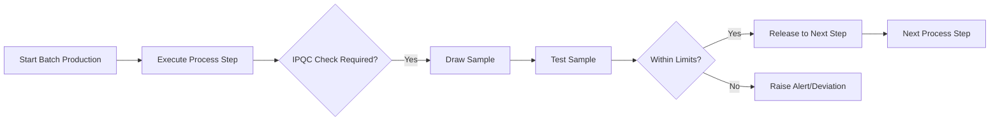
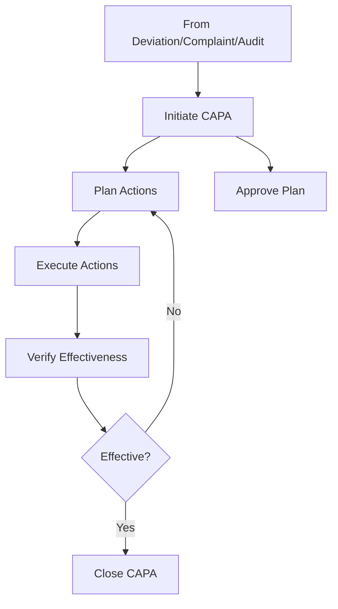

# Understanding QMS Modules in Life Sciences Supply Chain

## Introduction
This guide explores the Quality Management System (QMS) module in the Supply Chain OS platform, specifically tailored for Life Science manufacturers dealing with Active Pharmaceutical Ingredients (APIs) and Raw Materials. 

The goal is to ensure product quality, patient safety, and regulatory compliance (e.g., FDA, GMP).

---

## 1. In-Process Quality (IPQC)

### What it does & Why it exists
*   **What**: Monitors quality *during* the manufacturing process, not just at the end. It involves checks at specific steps (stages) of production.
*   **Why**: To detect errors early. If a batch is failing at the midway point, you can stop or adjust it, saving money and preventing bad product from moving to the next stage.

### End-to-End Flow


### Examples
*   **API**: During the reaction phase, checking the **pH level** every hour to ensure the chemical reaction is proceeding correctly.
*   **Raw Materials**: Checking the moisture content of a powder after a drying step before it is blended.

### Perspectives
*   **Quality Executive/QA**: "I need to configure *what* usually needs checking and approve the results before production continues."
*   **Production Manager**: "I need to know *when* to stop for a check so my team doesn't waste time waiting, and I need quick feedback if something is wrong."

---

## 2. Deviation Management

### What it does & Why it exists
*   **What**: Captures and manages any unplanned event or departure from approved procedures or specifications.
*   **Why**: In Pharma, you cannot just "fix it and move on." You must document *what* went wrong, *why* it went wrong, and prove that the final product is still safe (or reject it).

### End-to-End Flow
```mermaid
graph TD
    A[Event Occurs] --> B[Log Deviation]
    B --> C[Initial Assessment (Risk)]
    C --> D[Investigation (Root Cause)]
    D --> E[Impact Assessment]
    E --> F[Decision: Release or Reject Batch]
    F --> G[Close Deviation]
```

### Examples
*   **API**: A temperature sensor failed, and the reactor got 5 degrees hotter than allowed for 10 minutes.
*   **Raw Materials**: A shipment of solvent arrived with a broken seal, violating the receiving procedure.

### Perspectives
*   **Quality Executive/QA**: "I am the judge. I review the investigation to ensure we found the *real* root cause and that the risk to the patient is assessed correctly."
*   **Production Manager**: "I am the witness. I report what happened accurately so we can justify if the batch is saveable or not."

---

## 3. CAPA (Corrective and Preventive Action)

### What it does & Why it exists
*   **What**: The systemic fix. **Corrective** action fixes the immediate problem. **Preventive** action stops it from happening again in the future.
*   **Why**: Regulatory requirement. You can't make the same mistake twice. CAPA proves you improved your process.

### End-to-End Flow


### Examples
*   **API**: 
    *   *Issue*: Temperature sensor failed (Deviation).
    *   *Corrective*: Replace the sensor today.
    *   *Preventive*: Add a backup sensor and increase calibration frequency from yearly to quarterly.
*   **Raw Materials**:
    *   *Issue*: Vendor keeps sending damaged barrels.
    *   *Corrective*: Return damaged barrels.
    *   *Preventive*: Switch packaging requirements to steel drums instead of plastic.

### Perspectives
*   **Quality Executive/QA**: "I track these to closure. I need proof (effectiveness check) that the fix actually worked 3 months later."
*   **Production Manager**: "I implement the changes. If QA says we need a backup sensor, I arrange the installation."

---

## 4. In-Product Quality (Quality Control / Finishing)

### What it does & Why it exists
*   **What**: The final exam for the product. It involves rigorous testing of the finished batch against the Certificate of Analysis (CoA) specifications.
*   **Why**: This is the gatekeeper. No product leaves the factory without passing these tests. It guarantees the customer gets what they paid for.

### End-to-End Flow
```mermaid
graph LR
    A[Manufacturing Completed] --> B[Quarantine Status]
    B --> C[Sampling]
    C --> D[QC Lab Testing]
    D --> E[Review Results vs Spec]
    E --> F{Pass?}
    F -- Yes --> G[QA Release (Approved)]
    F -- No --> H[OOS Investigation]
    H --> I[Reject/Destroy or Remediate]
```

### Examples
*   **API**: Testing the *purity* (must be >99.5%) and *impurity profile* (no single impurity >0.1%) of the final powder.
*   **Raw Materials**: Often used for "Retesting" materials that have been sitting in the warehouse for a long time to ensure they haven't degraded.

### Perspectives
*   **Quality Executive/QA**: "I sign the CoA. My digital signature releases the batch for sale."
*   **Production Manager**: "I am finished with the batch. I move it to the warehouse and wait for the Green Label (Approved status) so I can ship it."

---

## 5. Product Complaints

### What it does & Why it exists
*   **What**: A formal channel to receive, log, and investigate feedback from customers or patients about potential defects.
*   **Why**: It's a key feedback loop. In Pharma, a complaint could indicate a safety issue. You are legally required to investigate them.

### End-to-End Flow
```mermaid
graph TD
    A[Customer Email/Call] --> B[Log Complaint]
    B --> C[Triage (Severity)]
    C --> D[Investigation (Retained Samples)]
    D --> E[Root Cause Analysis]
    E --> F[Response to Customer]
    E --> G[Trigger CAPA if needed]
    F --> H[Close Complaint]
```

### Examples
*   **API**: A drug manufacturer (your customer) says your API powder is clumping and won't dissolve in their machine.
*   **Raw Materials**: (Less common as outgoing, but if you are a supplier) A customer claims the solvent drum was contaminated with rust.

### Perspectives
*   **Quality Executive/QA**: "I treat every complaint as a potential recall. I need to know quickly if this is a one-off or if the whole batch is bad."
*   **Production Manager**: "I help investigate. Did we do something different on that day? I check the batch record."

---

## 6. Recall Management

### What it does & Why it exists
*   **What**: The emergency brake. It traces where every container of a bad batch went and initiates a return process.
*   **Why**: To protect public health. If a potentially dangerous product is out there, you need to get it back immediately.

### End-to-End Flow
```mermaid
graph TD
    A[Decision to Recall] --> B[Identify Batches]
    B --> C[Trace Distribution (Who has it?)]
    C --> D[Notify Regulatory & Customers]
    D --> E[Receive Returns]
    E --> F[Reconciliation (Did we get it all?)]
    F --> G[Destroy Product]
    G --> H[Close Recall]
```

### Examples
*   **API**: You discover a toxic impurity in a batch you sold 3 months ago. You must tell the drug manufacturer to stop using it and return it.
*   **Raw Materials**: You sold a binder that was mislabeled.

### Perspectives
*   **Quality Executive/QA**: "High stress. I coordinate everything. I need the system to tell me exactly who received Batch X within seconds."
*   **Production Manager**: "I support by validating how many units were produced vs. how many are left in the warehouse."

---

## 7. Adverse Event Reporting

### What it does & Why it exists
*   **What**: Tracks "Bad things" happening to patients who took the medicine. While Supply Chain focuses on the "product," this links the "product usage" back to quality.
*   **Why**: Patient Safety (Pharmacovigilance). If 10 patients report side effects from Batch A, but not Batch B, there is likely a quality defect in Batch A.

### End-to-End Flow
```mermaid
graph LR
    A[Patient Report] --> B[PV Team Assessment]
    B --> C{Technical Complaint?}
    C -- Yes --> D[Forward to QA (Complaint Module)]
    C -- No --> E[Regulatory Reporting Only]
    D --> F[Investigation linked to Batch]
```

### Examples
*   **API**: A patient had a severe allergic reaction. Was it a known side effect, or was there a cross-contamination in the API reactor with Penicillin (an allergen)?

### Perspectives
*   **Quality Executive/QA**: "I don't look at clinical side effects, but if the PV team detects a spike, I must investigate the manufacturing records immediately."
*   **Production Manager**: "Usually not involved unless a quality defect is suspected."

---

## 8. QMS Management (Document & Change Control)

### What it does & Why it exists
*   **What**: managing the "Rules" (SOPs), the "People" (Training), and the "Changes" (Change Control).
*   **Why**: If you change a process without telling anyone, or if operators follow old instructions, errors happen. This module keeps everyone aligned.

### End-to-End Flow (Change Control)
```mermaid
graph TD
    A[Propose Change] --> B[Impact Assessment]
    B --> C[Approval to Plan]
    C --> D[Execute Change (Update Docs, Train)]
    D --> E[Verification]
    E --> F[Final Approval to Go Live]
```

### Examples
*   **API**: Proposal to change the speed of the centrifuge to increase yield. This requires a "Change Control" to prove it doesn't affect purity.
*   **Raw Materials**: Updating the "Approved Vendor List" to add a new supplier.

### Perspectives
*   **Quality Executive/QA**: "I ensure no document is published without approval and no process is changed without authorization."
*   **Production Manager**: "I propose changes to make things faster/better. I ensure my team reads the new SOPs."

---

## 9. Supplier Management

### What it does & Why it exists
*   **What**: Selecting, qualifying, and monitoring the vendors who sell you Raw Materials.
*   **Why**: "Garbage In, Garbage Out." If your Raw Materials are bad, your API will be bad. You must audit your suppliers.

### End-to-End Flow
```mermaid
graph TD
    A[New Supplier Request] --> B[Send Questionnaire]
    B --> C[Audit Supplier (On-site/Paper)]
    C --> D[Evaluate Risk]
    D --> E{Approve?}
    E -- Yes --> F[Add to Approved Vendor List]
    E -- No --> G[Reject]
    F --> H[Ongoing Performance Monitoring]
```

### Examples
*   **API**: Evaluating a company in China that supplies the "Starting Material" for your synthesis.
*   **Raw Materials**: Assessing if a local packaging vendor has clean rooms for their plastic bags.

### Perspectives
*   **Quality Executive/QA**: "I audit them. I decide who we can buy from. I block suppliers who have too many complaints."
*   **Production Manager**: "I need reliable suppliers. If a supplier is 'Blocked' by QA, I cannot order from them, which stops my production line."
