```mermaid
graph LR
    A["Batch Manufacture Complete"] --> B["Status: Quarantine"]
    B --> C["QC Sampling Plan (e.g., √n + 1)"]
    C --> D["Wet Lab Analysis"]
    D --> E["Review vs Specification"]
    E --> F{"Pass?"}
    F -- Yes --> G["QA Release (Green Label)"]
    F -- No --> H["OOS (Out of Spec) Investigation"]
```

# Comprehensive Guide: QMS Modules in Life Sciences Supply Chain

## 📖 Introduction
This document provides an in-depth exploration of the Quality Management System (QMS) modules within a Supply Chain OS. It is designed for stakeholders in **Life Sciences** (Pharmaceuticals, Biotech) focusing on **API (Active Pharmaceutical Ingredients)** and **Raw Materials**.

**Core Objective**: To bridge the gap between physical supply chain execution and quality compliance (cGMP, FDA 21 CFR Part 210/211, ICH Q7).

---

## 1. In-Process Quality (IPQC)

### 🧐 Detailed Explanation
**What it is**: IPQC is the "pulse check" of manufacturing. Unlike Quality Control (QC) which tests the *finished* product, IPQC tests the *intermediate* product while it is being made.
**Why it exists**: 
*   **Cost Avoidance**: If a reaction fails at Step 3 of 10, continuing to Step 10 is a massive waste of expensive chemicals and time.
*   **Process Control**: It proves that your manufacturing process remains in a "state of control" as required by regulators.

### 🔄 End-to-End Process Flow

**Key Input**: Manufacturing Batch Record (MBR) defining "Hold Points".
**Key Output**: IPQC Test Report attached to the Batch Record.

### 🧪 Scenarios
*   **Scenario A: API Manufacturing (Reaction Kinetics)**
    *   *Context*: Making a complex API like *Atorvastatin*.
    *   *Action*: At the 5th hour of the reaction, the operator samples the reactor.
    *   *Test*: Thin Layer Chromatography (TLC) to check if "Starting Material A" has fully converted to "Intermediate B".
    *   *Outcome*: Limit is < 0.5% unreacted material. Process cannot move to "Crystallization" until this passes.
*   **Scenario B: Raw Material (Dispensing)**
    *   *Context*: Weighing active powder for formulation.
    *   *Action*: Operator sets up the weighing balance.
    *   *Test*: "Daily Balance Calibration" with standard weights before weighing the product.
    *   *Outcome*: Ensures the 50.0kg weighed is actually 50.0kg, not 49.5kg due to drift.

### 👥 Perspectives & Pain Points
*   **Quality Executive**: *"My pain point is data integrity. I need to know the operator didn't just write down a passing number. I want the machine to upload the result directly."*
*   **Production Manager**: *"Speed is everything. Waiting 4 hours for a pH test kills my efficiency. I need instant notifications when results are ready."*

---

## 2. Deviation Management

### 🧐 Detailed Explanation
**What it is**: The system for handling the "unexpected". In pharma, perfection is planned, but reality is messy. Deviations document constraints.
**Why it exists (Regulatory)**: FDA 21 CFR Part 211.192 requires any unexplained discrepancy to be investigated. You cannot release a batch with an open "Critical" deviation.

### 🔄 End-to-End Process Flow

### 🧪 Scenarios
*   **Scenario A: API (Equipment Failure)**
    *   *Event*: The reactor cooling jacket failed. Temp spiked to 45°C (Limit: 30°C) for 15 mins.
    *   *Investigation*: Did this degrade the molecule? Lab performs HPLC analysis on the material.
    *   *Conclusion*: Material is stable up to 50°C for 1 hour per validation study. Batch is safe.
    *   *Disposition*: **Released with Comment**.
*   **Scenario B: Raw Material (Shipping)**
    *   *Event*: A truck delivering Ethanol arrived with a broken security seal.
    *   *Risk*: Potential tampering or contamination.
    *   *Conclusion*: Cannot prove integrity.
    *   *Disposition*: **Rejected**. Material returned to vendor.

### 👥 Perspectives & Pain Points
*   **Quality Executive**: *"I spend 60% of my time here. I need a dashboard showing 'Aging Deviations' because if they stay open >30 days, we get flagged in audits."*
*   **Production Manager**: *"I hate writing these. I need templates that make it easy to describe 'Current situation' vs 'Expected situation' so I can get back to work."*

---

## 3. CAPA (Corrective & Preventive Action)

### 🧐 Detailed Explanation
**What it is**: The "immune system" of your factory. Deviation = The Injury. CAPA = The Treatment + Lifestyle Change to prevent recurrence.
**Why it exists**: To demonstrate **Continuous Improvement**. Auditors look for repeat deviations. If you have the same deviation 5 times, your CAPA system is failing.

### 🔄 End-to-End Process Flow

### 🧪 Scenarios
*   **Scenario A: API (Human Error)**
    *   *Root Cause*: Operator added "Reagent X" instead of "Reagent Y" because the bottles look identical.
    *   *Corrective Action*: Dispose of the bad batch.
    *   *Preventive Action*: Implement barcode scanning at the charging port. The system will now alarm if the wrong barcode is scanned.
*   **Scenario B: Raw Material (Supplier)**
    *   *Root Cause*: Supplier sent "Micronized" grade instead of "Regular" grade.
    *   *Preventive Action*: Update the "Quality Agreement" with the supplier to mandate color-coded labels for different grades.

### 👥 Perspectives
*   **Quality Executive**: *"The Effectiveness Check is vital. I need the system to remind me in 6 months to review if the barcode scanner actually stopped the errors."*
*   **Production Manager**: *"I need reasonable timelines. Don't simply say 'train everyone by tomorrow'. Give me time to schedule it."*

---

## 4. In-Product Quality (QC / Finishing)

### 🧐 Detailed Explanation
**What it is**: The final gate. Testing the finished good against the **Certificate of Analysis (CoA)** specification.
**Why it exists**: This is the legal promise to the customer. The CoA is a legal document.

### 🔄 Process Flow

### 🧪 Scenarios
*   **Scenario A: API (Purity)**
    *   *Spec*: Purity ≥ 99.0%.
    *   *Result*: 99.8%. **Pass**.
    *   *Action*: System generates PDF CoA, digitally signed by QC Manager. Batch status flips from `QUARANTINE` to `UNRESTRICTED`. Shipping can now book the truck.
*   **Scenario B: Raw Material (Retest)**
    *   *Context*: A drum of solvent has an expiry of 2 years. It has been in the warehouse for 1.9 years.
    *   *Action*: Auto-alert triggers "Retest required".
    *   *Outcome*: QC re-tests. If it passes, expiry is extended (if allowed); otherwise, it is moved to `BLOCKED` for destruction.

---

## 5. Product Complaints

### 🧐 Detailed Explanation
**What it is**: External feedback management. In pharma, every complaint is treated as a potential safety risk until proven otherwise.
**Why it exists**: Market surveillance. You need to know if your product is failing in the real world.

### 🔄 Process Flow

### 🧪 Scenarios
*   **Scenario A: API (Handling)**
    *   *Complaint*: Customer says the drum liner was torn and powder leaked.
    *   *Investigation*: warehouse camera shows fork-lift driver pierced the drum but didn't report it.
    *   *Outcome*: Confirmed Complaint. Refund customer. Retrain driver (CAPA).
*   **Scenario B: Counterfeit Suspect**
    *   *Complaint*: Customer tests product and finds 0% active ingredient.
    *   *Investigation*: Check "Serialization" data. The Batch ID reported by customer was never made by your factory.
    *   *Outcome*: Fake product. Notify Legal and Regulatory authorities.

---

## 6. Recall Management

### 🧐 Detailed Explanation
**What it is**: The reverse logistics fire-drill. Identifying where every mg of a batch has gone and getting it back.
**Why it exists**: Patient Safety. If a batch is toxic, speed saves lives.

### 🔄 Process Flow

### 👥 Perspectives
*   **Quality Executive**: *"I need a 'Mock Recall' button. I need to prove to auditors that I can trace 100% of a batch within 4 hours."*
*   **Production Manager**: *"I support by immediately locking any remaining stock so it doesn't leave the dock."*

---

## 7. Adverse Event Reporting (Pharmacovigilance Link)

### 🧐 Detailed Explanation
**What it is**: Collecting medical data on side effects.
**Why it exists**: While Supply Chain manages *boxes*, this module manages *clinical impact*. A spike in adverse events for a specific batch usually points to a supply chain/quality failure (e.g., contamination).

### 🧪 Scenario
*   **Scenario**: 5 patients report "severe burning" at injection site.
*   **Link**: All 5 used vials from Lot #123.
*   **Action**: Automate a high-priority "QA Investigation" for Lot #123 production records to look for pH deviations.

---

## 8. QMS Management (Change Control & Docs)

### 🧐 Detailed Explanation
**What it is**: The "Law" of the factory. Managing SOPs (Standard Operating Procedures) and controlling *changes* to them.
**Why it exists**: "If it isn't written down, it didn't happen." You cannot change a machine speed just because you feel like it.

### 🔄 Change Control Flow
1.  **Proposal**: Engineer wants to install a faster mixer.
2.  **Assessment**: QA, Regulatory, and Safety review. (Will it change the crystal structure of the API?)
3.  **Pre-Approval**: Allowed to install for "Trial Runs" only.
4.  **Validation**: Run 3 batches. Test heavily.
5.  **Final Approval**: Go-Live for commercial production.

---

## 9. Supplier Management

### 🧐 Detailed Explanation
**What it is**: Vendor Quality Assurance.
**Why it exists**: You are responsible for the materials you use. If your supplier cheats, YOU are liable.

### 🧪 Scenarios
*   **Scenario: Qualification**
    *   New API Starting Material vendor in Italy. 
    *   **Action**: Send Audit team. Check their water system, their labs, their cleaning records.
    *   **Outcome**: "Approved pending corrective actions".
*   **Scenario: Scorecarding**
    *   Vendor A has 3 late deliveries and 1 torn bag in Q1.
    *   **System Action**: Downgrade rating from "Preferred" to "Probation". Auto-trigger increased sampling (test *every* drum instead of every 10th drum).

### 👥 Perspectives
*   **Quality Executive**: *"I want the system to automatically block purchase orders if the supplier's GMP certificate has expired."*
